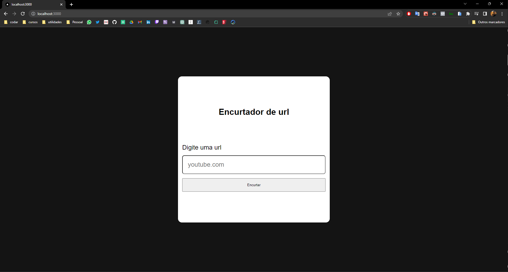

# URL SHORTENER 📚

<!---Esses são exemplos. Veja https://shields.io para outras pessoas ou para personalizar este conjunto de escudos. Você pode querer incluir dependências, status do projeto e informações de licença aqui--->
<h1>
  Tecnologias 👨‍💻
  </br>
  </br>
  <div align="center">
    
    
    
    
  </div>
</h1>

<p align="center">
  
</p>

<!-- > Link da aplicação: <a href="https://todo-list-one-pi.vercel.app/" target="_blank">Todo List</a> -->

</br>

## ✔️ Funcionalidades

Projeto concluído ✅:

- [x] Conseguir cadastrar uma url
- [x] Conseguir ler a url salva no banco
- [x] Conseguir redirecionar ao acessar a url com o id que foi salva no banco de dados

## 🖖🏼 Objetivo

Criar um aplicativo de encurtador de url

## 💻 Pré-requisitos

Antes de começar, verifique se você atendeu aos seguintes requisitos:

<!---Estes são apenas requisitos de exemplo. Adicionar, duplicar ou remover conforme necessário--->

- Ter instalado o nodeJs na versão <strong>18.16.1</strong> ou superior
- Verificar se não tem nenhum processo rodando na porta: <strong>3000</strong>
- Verificar se não tem nenhum processo rodando na porta: <strong>3306</strong>

## 🚀 Instalando Url Shortener

Para instalar o Url Shortener, siga estas etapas:

</br>

**Linux, macOS e Windows :**

**Clone o repositório**

```
  git clone https://github.com/rms-diego/url-shortener.git && cd url-shortener
```

Depois execute os seguintes comando

**Npm**

<strong>Antes de rodar o comando certifique-se de já ter criado o arquivo '.env' conforme descrito no arquivo '.env.example'</strong>

```
  npm i && npm run dev
```

**Docker**

<strong>Antes de rodar o comando certifique-se de já ter criado o arquivo '.env' conforme descrito no arquivo '.env.example'</strong>

```
  docker-compose up
```
